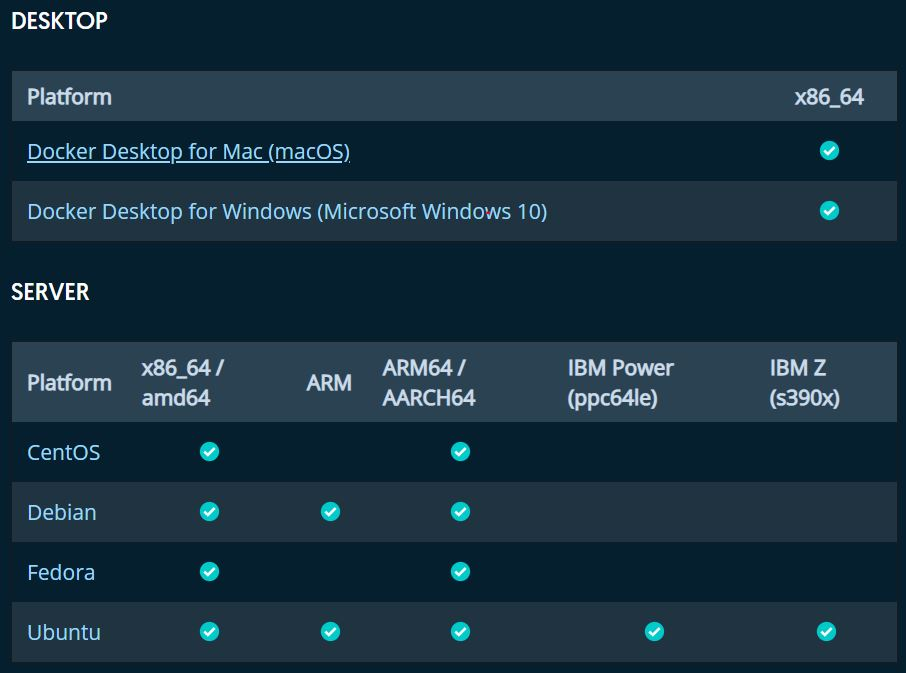

| Michael Bielang, <Michael.Bielang@hs-augsburg.de>, IN6, #2036823

Setup
==================================

Docker bietet unter https://www.docker.com/get-started für Mac, Windows und Linux verschiedenste Installer an.

.. _figlabel:



Im weiteren Verlauf wird die Windows Version untersucht.


Installation prüfen
---------

Um die Installation zu prüfen sollte der Nutzer zunächst ``docker info`` in die Windows-Shell eingeben. Dies ermöglicht dem Nutzer zu prüfen, ob die Docker-Enginge läuft und auch die Path erweiterungen richtig installiert wurde. Der Nutzer sollte dann in etwa folgendes ausgegeben bekommen:

.. code-block:: go

	PS D:\Git\DVA Praktikum\Docker> docker info
	Containers: 1
	 Running: 0
	 Paused: 0
	 Stopped: 1
	Images: 1
	Server Version: 18.09.2
	Storage Driver: overlay2
	 Backing Filesystem: extfs
	 Supports d_type: true
	 Native Overlay Diff: true
	Logging Driver: json-file
	Cgroup Driver: cgroupfs
	Plugins:
	 Volume: local
	 Network: bridge host macvlan null overlay
	 Log: awslogs fluentd gcplogs gelf journald json-file local logentries splunk syslog
	Swarm: inactive
	Runtimes: runc
	Default Runtime: runc
	Init Binary: docker-init
	containerd version: 9754871865f7fe2f4e74d43e2fc7ccd237edcbce
	runc version: 09c8266bf2fcf9519a651b04ae54c967b9ab86ec
	init version: fec3683
	Security Options:
	 seccomp
	  Profile: default
	Kernel Version: 4.9.125-linuxkit
	Operating System: Docker for Windows
	OSType: linux
	Architecture: x86_64
	CPUs: 2
	Total Memory: 1.934GiB
	Name: linuxkit-00155db22605
	ID: 562F:LB34:MR6P:SBWB:IPFX:3YB4:4LXT:GKTH:B6HR:TXN4:FCMB:MFCY
	Docker Root Dir: /var/lib/docker
	Debug Mode (client): false
	Debug Mode (server): true
	 File Descriptors: 22
	 Goroutines: 47
	 System Time: 2019-04-15T13:32:06.5766985Z
	 EventsListeners: 1
	Registry: https://index.docker.io/v1/
	Labels:
	Experimental: false
	Insecure Registries:
	 127.0.0.0/8
	Live Restore Enabled: false
	Product License: Community Engine


Das erste Docker Image 
---------

Docker hat wie auch Git, dass Feature über die Kommandokonsole ein Image runterzuladen.

Zu Versuchszwecken laden wir uns daher mit dem Kommando ``docker pull hello-world`` unser erstes Image herunter.

Im nächsten Schritt führen wir den Befehl ``docker run hello-world`` aus und erhalten

.. code-block:: go

	Hello from Docker!
	This message shows that your installation appears to be working correctly.

	To generate this message, Docker took the following steps:
	 1. The Docker client contacted the Docker daemon.
	 2. The Docker daemon pulled the "hello-world" image from the Docker Hub.
		(amd64)
	 3. The Docker daemon created a new container from that image which runs the
		executable that produces the output you are currently reading.
	 4. The Docker daemon streamed that output to the Docker client, which sent it
		to your terminal.

Mit ``docker image ls`` erhält der User eine Übersicht über vorhandene Images das in diesem Fall wie folgt aussieht:

.. code-block:: go

	PS D:\Git\DVA Praktikum\Docker> docker image ls
	REPOSITORY          TAG                 IMAGE ID            CREATED             SIZE
	hello-world         latest              fce289e99eb9        3 months ago        1.84kB

``docker container ls --all`` informiert den Nutzer über jegliche Interaktion mit allen bisher genutzten Containern. 


.. code-block:: go

	CONTAINER ID        IMAGE               COMMAND             CREATED             STATUS                      PORTS               NAMES
	e41f8d0d1520        hello-world         "/hello"            2 seconds ago       Exited (0) 1 second ago                         pedantic_ardinghelli
	31a9651c74e8        hello-world         "/hello"            11 minutes ago      Exited (0) 11 minutes ago                       infallible_khayyam
	0f8d403a7d38        hello-world         "/hello"            14 minutes ago      Exited (0) 14 minutes ago                       modest_kapitsa


Die Entwicklungsumgebung
``````````````````````````````````

Man stelle sich vor, man hat ein neues System und möchte dort eine Python App ausführen.

Als Anwender müsste man nun zuerst von Oracle die korrekten Module herunterladen, installieren und ggf. das System neu starten. Nun stelle man sich vor, dass ist das tägliche Geschäft mit unterschiedlichen Entwicklungsumgebungen und Plattformen. 

Umständlich und zeitraubend.

Mit ``Dockerfile`` kann man einfach eine portable Python (oder x-beliebige) Umgebung herunterladen und direkt ausführen.

 
Dockerfile 
``````````````````````````````````

In Dockerfiles wird unter anderem definiert, wer welchen Zugriff auf das Netzwerk-Interface, die Datenträger, welche Ports und welche Art von Programmen ausgeführt werden dürfen.

Damit werden sozusagen die Regeln für diesen Container definiert, sodass man auf jeder Plattform stets das selbe Verhalten erwarten kann.

In der Praxis bedeutet das:

Wir erstellen zunächst ein ``Dockerfile`` auf unserem Rechner. Dies hat keine Dateiendung (wichtig!)

In diese Datei kommen folgende Informationen:

.. code-block:: go

	# Nutzt die offizielle Python Umgebung
	FROM python:2.7-slim

	# Setzt das Arbeitsverzeichnis auf /app
	WORKDIR /app

	# Kopiert den Inhalt aus dem Hauptverzeichnis nach /app
	COPY . /app

	# Installiert alle nötigen Abhängigkeiten in requirements.txt
	RUN pip install --trusted-host pypi.python.org -r requirements.txt

	# Öffnet den Port 80 zur Kommunikation ausserhalb des Containers 
	EXPOSE 80

	# Definiert Umgebungsvariable
	ENV NAME World

	# Startet app.py wenn der Container startet
	CMD ["python", "app.py"]


Wie man sehen kann, referenziert der Inhalt auf die Dateien ``requirements.txt`` sowie ``app.py``

Diese erstellen wir hiermit ebenfalls. In die ``requirements.txt`` kommt folgender Inhalt:


.. code-block:: go

	Flask
	Redis
	
und in ``app.py``


.. code-block:: go

	from flask import Flask
	from redis import Redis, RedisError
	import os
	import socket

	# Connect to Redis
	redis = Redis(host="redis", db=0, socket_connect_timeout=2, socket_timeout=2)

	app = Flask(__name__)

	@app.route("/")
	def hello():
		try:
			visits = redis.incr("counter")
		except RedisError:
			visits = "<i>cannot connect to Redis, counter disabled</i>"

		html = "<h3>Hello {name}!</h3>" \
			   "<b>Hostname:</b> {hostname}<br/>" \
			   "<b>Visits:</b> {visits}"
		return html.format(name=os.getenv("NAME", "world"), hostname=socket.gethostname(), visits=visits)

	if __name__ == "__main__":
		app.run(host='0.0.0.0', port=80)	
		
		
Nachdem wir nun alle relevanten Dateien erstellt haben führen wir in der Konsole den Befehl ``docker build --tag=friendlyhello .`` aus.

Wir sehen nun folgende Resultate auf der Kommandokonsole (gekürzt)

.. code-block:: go

	Step 1/7 : FROM python:2.7-slim
	2.7-slim: Pulling from library/python
	27833a3ba0a5: Pull complete
	8b35abcb27de: Pull complete
	cd1fc6dee9fe: Pull complete
	2c6a92003566: Pull complete
	Status: Downloaded newer image for python:2.7-slim
	 ---> 48e3247f2a19
	Step 2/7 : WORKDIR /app
	 ---> Running in e62bc2b9c2bc
	Removing intermediate container e62bc2b9c2bc
	 ---> 5d5fe74be1ca
	Step 3/7 : COPY . /app
	 ---> e99a485ebf96
	Step 4/7 : RUN pip install --trusted-host pypi.python.org -r requirements.txt
	 ---> Running in 6ffbec1c9f9f
	Collecting Flask (from -r requirements.txt (line 1))
	Step 5/7 : EXPOSE 80
	 ---> Running in 3ae1b0767615
	Removing intermediate container 3ae1b0767615
	 ---> 061c09aaf7b7
	Step 6/7 : ENV NAME World
	 ---> Running in b937fa19212d
	Removing intermediate container b937fa19212d
	 ---> d28131045e07
	Step 7/7 : CMD ["python", "app.py"]
	 ---> Running in ad4dc128b2f7
	Removing intermediate container ad4dc128b2f7
	 ---> c23c3caafa8e
	Successfully built c23c3caafa8e
	Successfully tagged friendlyhello:latest
	
	
Führen wir jetzt noch einmal ``docker image ls`` aus, so erhalten wir:

.. code-block:: go

	REPOSITORY          TAG                 IMAGE ID            CREATED             SIZE
	friendlyhello       latest              c23c3caafa8e        24 minutes ago      131MB
	python              2.7-slim            48e3247f2a19        2 weeks ago         120MB
	hello-world         latest              fce289e99eb9        3 months ago        1.84kB
	
	
Ausführen einer App im Container
``````````````````````````````````	

Mit ``docker run -p 4000:80 friendlyhello`` starten wir den Container.

Wenn wir nun im Browser ``localhost:4000`` angeben erscheint die Nachricht:

.. code-block:: go

	Hello World!
	Hostname: cec41d233a83
	Visits: cannot connect to Redis, counter disabled

	
Was an dieser Stelle nun auffällt ist, dass wir unserem Python Programm ja den Port 80 zugwiesen haben, wir aber nun mittels dem Port 4000 auf die App zugreifen.

Grund dafür ist, dass innerhalb des Containers die App zwar auf dem Port 80 lauscht, wir aber mittels der Docker-Engine den Port 4000 des Host nutzen, um die Anfragen auf den Port 80 des Containers weiterleiten.


Beenden einer aktiven App im Container

Unter Windows verursacht der Kommandokonsolenbefehl ``CTRL + C`` lediglich kosmetisch ein Ende der App. Tatsächlich läuft der Service im Hintergrund noch weiter und nutzt entsprechend Ressourcen.

Mittels dem Befehl ``docker container ls`` können wir uns alle noch laufenden Container-Instanzen anzeigen lassen.

Wie wir hier nun sehen, obwohl eigentlich terminiert, läuft der Container-Service noch

.. code-block:: go

	CONTAINER ID        IMAGE               COMMAND             CREATED             STATUS              PORTS                  NAMES
	cec41d233a83        friendlyhello       "python app.py"     16 minutes ago      Up 16 minutes       0.0.0.0:4000->80/tcp   reverent_brown

Erst der Befehl ``docker container stop <Container NAME or ID>`` also in diesem Fall ``docker container stop cec41d233a83`` terminiert den Prozess. Dies lässt sich nun durch die erneute Prüfung mittels ``docker container ls`` nachvollziehen.
	

Quellen:
--------

https://docs.docker.com/