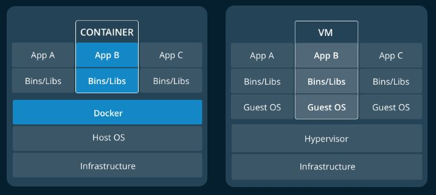

| Mirjam Lawall, <Mirjam.Lawall@hs-augsburg.de>, IN6, #2003849


Einführung - Was ist Docker
==================================

Mit Docker können wir unsere Anwendung und die dazugehörende Plattform ( Betriebsystem, Laufzeitumgebung, Libraries … ) in ein Image packen und diese von jedem Gerät abspielen lassen. Grundvoraussetzung ist, dass auf dem Gerät Docker installiert ist. Docker kann das Image lesen und erstellt einen Container, der auf allen Geräten, sowohl auf einem Computer, Laptop oder Cloud läuft.


Das Docker Image
----------------

Docker Images sind die Grundlage für Docker Container. Es ist ein ausführbares Paket, dass unter anderem App-Code, eine Laufzeitumgebung, Bibliotheken, Umgebungsvariablen und Konfigurationsdatein. Dabei hat keinen Zustand und ist somit read-only. Mehr dazu siehe unten.


Der Docker Container
---------------------

Mit dem Programm ``Docker Enginge`` ist es dann möglich diese Images mit Docker als Container zu nutzen.

.. _figlabel:

.. figure:: img/container-what-is-container.png

Diese gibt es in den Ausführungen:

``Standart:``

Portabler Docker Container mit eigenem OS.

``Leightweight:``

Container teilen sich System Kernel und benötigen daher kein eigenes Betriebssystem je Anwendung.


``Secure:``

Container sind mit Docker-eigenen Tools verschlüsselt und damit sicherer aber auch etwas langsamer.

Ein Docker Container entsteht also mit einem Image und erlaubt mittels der Docker Enginge Veränderungen an diesem zuzulassen.

Man kann also das Konzept von Container-Schiffen übernehmen. Dort werden Standarts definiert, wie Container mit Gütern transportiert werden müssen.
Docker definiert einen Standart, wie man Software transportiert.

.. _figlabel:

.. figure:: img/laurel-docker-containers.png


Abgrenzung Container und Image
``````````````````````````````

Um die oben genannten Unterschiede zu verdeutlichen liefere ich hier ein kleines Bash-Beispiel.

Die erste Zeile erstellt in einer interaktiven Ubuntu Sitzung ``-i -t``
Dort erstellen wir eine Datei foo im Verzeichnis cat und speichern sie ab. Die Sitzung wird beendet.

.. code-block:: go


	$ docker run -i -t ubuntu  /bin/bash
	root@48cff2e9be75:/# ls
	bin  boot  dev  etc  home  lib  lib64  media  mnt  opt  proc  root  run  sbin  srv  sys  tmp  usr  var
	root@48cff2e9be75:/# cat > foo
	This is a really important file!!!!
	root@48cff2e9be75:/# exit
	

Starten wir die Sitzung erneut und führen den Befehl ``ls`` aus, so sehen wir, dass die noch vorhin erstellte Datei nicht mehr vorhanden ist:

.. code-block:: go	

	$ docker run -i -t ubuntu  /bin/bash
	root@abf181be4379:/# ls
	bin  boot  dev  etc  home  lib  lib64  media  mnt  opt  proc  root  run  sbin  srv  sys  tmp  usr  var
	root@abf181be4379:/# exit
	
Arbeiten wir nun mit einem ``Container`` anstatt eines ``Image``, comitten und erzeugen ein Image aus dem Container ``48cff2e9be75`` das Image ``unbuntu-foo`` ...
	
.. code-block:: go	

	$ docker ps -a
	CONTAINER ID        IMAGE               COMMAND                CREATED              STATUS                          PORTS                      NAMES
	abf181be4379        ubuntu:14.04        /bin/bash              17 seconds ago       Exited (0) 12 seconds ago                                  elegant_ardinghelli    
	48cff2e9be75        ubuntu:14.04        /bin/bash              About a minute ago   Exited (0) 50 seconds ago                                  determined_pare        
	...
	
... so erhalten wir ein neues Image mit der Datei foo im Verzeichnis ``bin/cat``

.. code-block:: go	

	$ docker commit 48cff2e9be75 ubuntu-foo
	d0e4ae9a911d0243e95556e229c8e0873b623eeed4c7816268db090dfdd149c2
	
.. code-block:: go	

	$ docker run ubuntu-foo /bin/cat foo
	This is a really important file!!!!
		
	
Hier kann man also sehr gut sehen, dass Images unveränderliche Abbildungen von live containern sind. Container sind also laufende oder gestoppte Instanzen von Images.

Mit dem Befehl ``docker imgaes`` ist es dem Anwender dann möglich, sich die zwei Images ``ubuntu`` und ``ubuntu-foo`` anzeigen zu lassen.

Abgrenzung Container und VM
``````````````````````````````````

Vom Leightweight Docker Container ausgegangen liegen hier die Vorteile auf der Hand.

Der Container läuft auf dem OS und teilt sich ``nativ`` Kernel/Speicher des Hosts.

Im Gegensatz zu einer VM, welches ein vollwertiges Betriebssystem bereit stellt mit einem ``virtuellen Zugriff`` auf die Host Ressourcen mittels einem weiteren Scheduler als Vermittlungsinstanz.

Das letzte Modell kann in einigen Fällen also deutlich mehr Ressourcen für die Bereitstellung der Umgebung benötigen, als für die eigentliche Anwendung relevant wäre.

.. _figlabel:



Quellen:
--------

https://stackoverflow.com/questions/21498832/in-docker-whats-the-difference-between-a-container-and-an-image

https://docs.docker.com/get-started/

https://www.docker.com/resources/what-container

https://docs.docker.com/glossary/?term=image

https://docs.docker.com/glossary/?term=container
