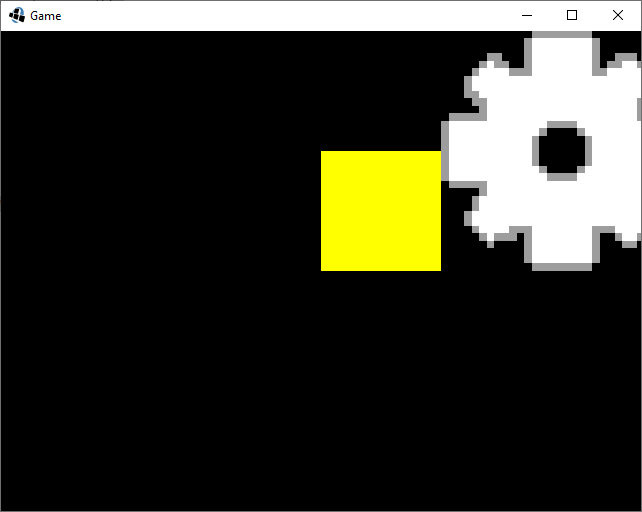

Felix Bühler, <felix.buehler@hs-augsburg.de>, IN6, #2008336

Projekt Setup
=============

Mit Installer
-------------

Schritte des Installers befolgen.

Ohne Installer
--------------

Der Einfachheit halber wird das Projekt nicht in mehrere Einzelprojekte geteilt, da in diesem Beispiel nur die Desktopversion verwendet wird.
Da der Hauptcode im Core Projekt des Installers sich nicht von dem ohne Installer unterscheidet ist die generelle Verwendung nicht seht unterschiedlich.

Zunächst erstellt man mit einer beliebigen IDE die Java und Gradle unterstzütz ein Gradle fähiges Java Projekt.

In die build.gradle schreibt man dann für eine minimal Konstellation mit VisUI:

.. code-block:: gradle

	plugins {
		id 'java-library'
	}

	repositories {
		jcenter()
	}

	ext {
		gdxVersion = '1.9.9'
	}

	dependencies {
		implementation "com.badlogicgames.gdx:gdx-platform:$gdxVersion:natives-desktop"
		implementation "com.badlogicgames.gdx:gdx-backend-lwjgl:$gdxVersion"
		
		implementation "com.badlogicgames.gdx:gdx:$gdxVersion"
		implementation "com.kotcrab.vis:vis-ui:1.3.0"
	}

Wenn man dann das gradle Projekt refresht kann man schon loslegen.

Zunächst wird eine Klasse erstellt die ApplicationListener implementiert oder von ApplicationAdapter erbt.

.. code-block:: java

	public class Game extends ApplicationAdapter{
	
	}
	

In einer Klasse muss dann nur noch ein Objekt dieser Klasse einem der Zahlreichen Application Klassen übergeben werden, hier LwjglApplication.

.. code-block:: java

	public class Game extends ApplicationAdapter{
		public static void main(String[] args) {
			LwjglApplicationConfiguration config = new LwjglApplicationConfiguration();
			new LwjglApplication(new Game(), config);
		}
	}

Erste Schritte
---------------

Nun sollte man sich in die vom Installer vorgegebene Hauptklasse oder die selbst erstelle begeben(implementiert immer ApplicationListener oder erbt von ApplicationAdapter).
	
Create-Methode
--------------

In der Create-Methode wird das Spiel vorbereitet.
Hier werden zum Beispiel Resourcen geladen.
Objekte die konstant bleiben sollen sollten hier erstellt werden.

Render-Methode
--------------

Die Render-Methode sowohl verwendet um das Spiel darzustellen als auch die Logik upzudaten.

Generell empfiehlt sich am beginn der Methode einmal

.. code-block:: java

	Gdx.gl.glClearColor(0, 0, 0, 1);
	Gdx.gl.glClear(GL20.GL_COLOR_BUFFER_BIT);
	
aufzurufen um eventuelle Render-Fehler zu verhindern.

Filehandling
------------

Um möglichst viele Plattformen zu bedienen verwendet man in libgdx keine klassichen Java-Files mehr sondern sogenannte FileHandle.

Diese werden über das `Gdx.files` Objekt erfasst.

Im Wiki finden sich die plattformspezifischen Unterschiede der einzelnen FileHandle Typen.
[0]_

Classpath
.........

Mit `Gdx.files.classpath(path)` lassen sich Dateien direkt aus dem Classpath laden.
Hierbei muss nur darauf geachtet werden das der Classpath nicht wie in Java mit . sondern mit / angegeben wird.

Rendern
-------

Da libgdx auf OpenGl setzt lassen sich dinge mit OpenGl rendern.
Zusätzlich bietet es aber auch noch zahlreiche Vereinfachungen an.

Bilder lassen sich einfach mit Hilfe der Texture Klasse erstellen, sowie mit einer Pixmap manuell erstellen.

.. code-block:: java

	public class Game extends ApplicationAdapter{
		public static void main(String[] args) {
			LwjglApplicationConfiguration config = new LwjglApplicationConfiguration();
			new LwjglApplication(new Game(), config);
		}
		
		private Texture image;
		private Texture pixmapImage;
		
		
		@Override
		public void create(){
			image = new Texture(Gdx.files.classpath("beispiele/Image.png"));
			
			Pixmap pixmap = new Pixmap(16, 16, Format.RGBA8888);
			pixmap.setColor(Color.YELLOW);
			pixmap.fill();
			
			pixmapImage = new Texture(pixmap);
			
			pixmap.dispose();
		}
	}

Um die Bilder nun zu rendern benötigt man ein SpriteBatch und eine Kamera;
Die Kamera stellt hierbei die Weltansicht zur Verfügung und berechnet die Matrizen.

.. code-block:: java

	public class Game extends ApplicationAdapter{
		public static void main(String[] args) {
			LwjglApplicationConfiguration config = new LwjglApplicationConfiguration();
			new LwjglApplication(new Game(), config);
		}
		
		private Texture image;
		private Texture pixmapImage;
		
		private SpriteBatch batch;
		private OrthographicCamera camera;
		
		
		@Override
		public void create(){
			image = new Texture(Gdx.files.classpath("beispiele/Image.png"));
			
			Pixmap pixmap = new Pixmap(16, 16, Format.RGBA8888);
			pixmap.setColor(Color.YELLOW);
			pixmap.fill();
			
			pixmapImage = new Texture(pixmap);
			
			pixmap.dispose();
			
			batch = new SpriteBatch();
			camera = new OrthographicCamera(64*Gdx.graphics.getWidth()/Gdx.graphics.getHeight(), 64);
		}
		@Override
		public void render(){
			Gdx.gl.glClearColor(0, 0, 0, 1);
			Gdx.gl.glClear(GL20.GL_COLOR_BUFFER_BIT);
			
			camera.update();
			batch.setProjectionMatrix(camera.combined);
			
			batch.begin();
			batch.draw(pixmapImage, 0, 0);
			batch.draw(image, 16, 0);
			batch.end();
		}
	}
	
Die Kamera Breite und Höhe werden hier auf die Fenstergröße und Bildgröße angepasst sodass man die kleinen Bilder auch sehen kann.
	

Quellen
-------

.. [0] Libgdx Wiki Filehandling
	https://github.com/libgdx/libgdx/wiki/File-handling