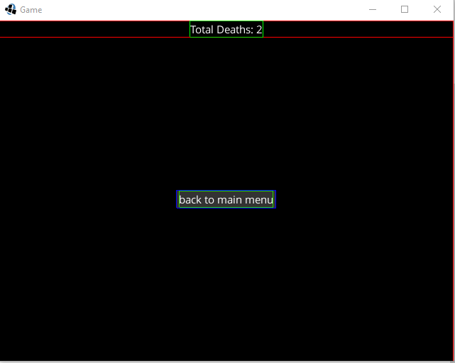
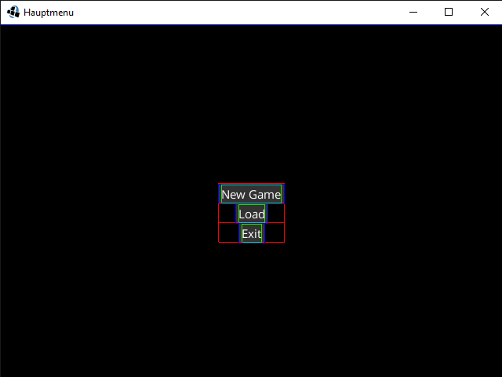
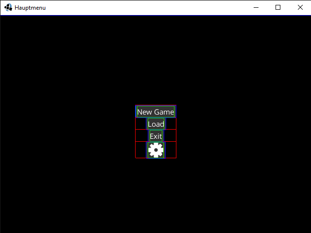
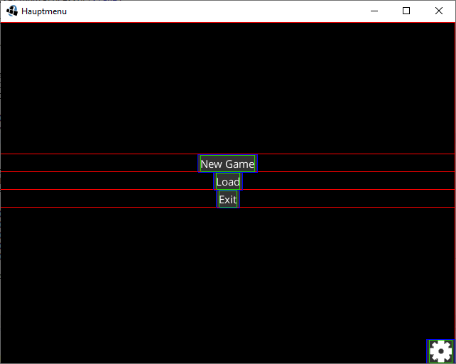

| Mirjam Lawall, <Mirjam.Lawall@hs-augsburg.de>, IN6, #2003849

Scene2d
=======

Scene2d ist ein 2D Szenengraph der verwendet wird um mit libgdx UI zu bauen.
Hierfür wird eine Hierachie von Darstellern verwendet.

Features:

- Rotation und Skalierung einer Gruppe wird auf alle Kinder angewendet.
  Kinder arbeiten immer im selben Koordinatensystem, veränderungen an 
  den Eltern werden transparent angewendet.
- Vereinfachtes 2D zeichnen. Jeder Darsteller zeichnet sich unscaliert 
  und unrotiert im selben Koordinatensystem, in dem 0,0 immer links unten ist.
- Trefferfeststellung von rotierten und skalierten Darstellern. Jeder Darsteller 
  stellt mithilfe seines unskalierten unrotierten Koordinatensystems fest ob er
  getroffen wurde.
- Routing von Input und anderen Events zum richtigen Darsteller. Das Eventsystem 
  erlaubt es Eltern Events vor oder nach den Kindern zu verarbeiten.
- Aktionssystem für einfache Manipulation der Darsteller über Zeit. 
  Aktionen können kombiniert oder aneinander gekettet werden um den richtigen Effekt zu erzielen.

[0]_

Scene2d baut auf 3 Kernklassen auf:

Stage
-----

Die Stage wird verwendet um den Szenengraphen darzustellen und Input zu steuern.
Um die Stage zu verwenden müssen die Methoden act und draw in der render Methode 
des Spiels aufgerufen werden.
Weiterhin muss die Stage als InputProcessor festgelegt sein um Input zu empfangen.

Minimal Beispiel:

.. code-block:: java
	
	public class StageTest extends ApplicationAdapter{
		private Stage stage;
		
		
		@Override
		public void create(){
			stage = new Stage();
			
			Gdx.input.setInputProcessor(stage);
		}
		@Override
		public void render(){
			Gdx.gl.glClear(GL20.GL_COLOR_BUFFER_BIT);
			
			stage.act();
			stage.draw();
		}
	}

Actor
-----

Ein Actor(Darsteller) ist ein Element im Graph welches eine Position,
eine rechteckige Größe, Ursprung, Skalierung, Rotation und Farbe besitzt.

Group
-----

Eine Gruppe ist ein Actor der mehrere Kinder besitzen kann.

scene2d.ui
----------

Das UI package enthält bereits Implementationen für einige bekannte UI-Elemente.
Hier finden sich unter anderem Textbuttons, Label und Dialoge wieder.

Nahezu alle UI-Elemente im UI package benötigen einen Style, welcher vorher 
mit Code oder JSON definiert werden muss.

Mehrere Styles können dann in einem Skin zusammengefasst werden.

Libgdx selbst gibt hierfür keine vordefinierten Styles, weshalb VisUI ins 
leben gerufen wurde.

VisUI
-----

VisUI enthält einen Skin mit Styles für alle scene2d.ui implementationen, 
zusätzlich enthält die Bibliothek noch viele überarbeitete Darsteller mit einfacheren Anwendungsmöglichkeiten.
VisUI kann beim erstellen des Projekts mithilfe der Setup App ganz einfach hinzugefügt werden.
Um es zu verwenden muss dann nur noch in der create Methode `VisUI.load();` aufgerufen wernde.

Programmierung + Debugging
--------------------------

Zum debuggen kann die Methode setDebugAll der Stage verwendet werden.

Als Beispiel nun ein Hauptmenü für ein Spiel.

Wir wollen ein Hauptmenü für ein Spiel erstellen.
Hierfür benötigen wir einen Button um ein neues Spiel zu erstellen,
einen um einen Spielstand zu laden,
einen um das Spiel zu beenden und einen um in die Optionen zu gelangen.

Der Optionen Button soll als Bild angezeigt werden und sich im unterm rechten Eck befinden.

Zunächst sollte ein Table verwendet werden dieser erlaubt es Actors tabellarisch anzuordnen.
Dieser sollte auf die Größe der Stage skaliert werden um das komplette Fenster auszufüllen.

.. code-block:: java

	...
	private void createMenu(){
		Table table = new Table();
		table.setFillParent(true);
		
		stage.addActor(table);
	}
	...

Nun sollten der Neues-Spiel-, Lade- und Spiel-Beende-Button
zum table hinzugefügt werden.
Um keine Styles erstellen zu müssen kann hier die VisUI 
implementationen des Textbuttons verwendet werden.

.. code-block:: java

	...
	private void createMenu() {
		Table table = new Table();
		table.setFillParent(true);
		
		table.add(new VisTextButton("New Game")).row();
		table.add(new VisTextButton("Load")).row();
		table.add(new VisTextButton("Exit")).row();
		
		stage.addActor(table);
	}
	...

Nun müssen wir noch das Bild für den Optionen Button in den assets 
ordner legen und diesen hinzufügen. Um dem Button ein Bild hinzuzufügen 
brauchen wir ein Object das Drawable implementiert. Hierfür eignet sich
TextureRegionDrawable was wiederum eine Texture benötigt. Wenn das Bild im 
assets Ordner liegt lässt sich die Texture einfach mit `new Texture("Options.png")` erstellen.

.. code-block:: java

	...
	private void createMenu() {
		Table table = new Table();
		table.setFillParent(true);
		
		table.add(new VisTextButton("New Game")).row();
		table.add(new VisTextButton("Load")).row();
		table.add(new VisTextButton("Exit")).row();
		table.add(new VisImageButton(new TextureRegionDrawable(new Texture("Options.png"))));
		
		stage.addActor(table);
	}
	...

Nun befindet sich der Optionen Button noch an der falschen Stelle.
Um den Button richtig zu positionieren sollte man wissen wie der Table 
funkioniert. Ein Table wird in einzelne Zellen aufgespaltet, welche
einen Darsteller enthalten können. Die größe der Zelle passt sich 
normalerweise an seinen Inhalt an, kann aber auch geändert werden.
`expand()` lässt die Zelle den größtmöglichen Platz einnehmen, wobei
wenn mehrere Zellen gleichzeit expanded sind alle versuchen die selbe 
größe anzunehmen. Fügt man nun eine Zelle vor den NewGame Button und 
wendet `expand()` an und wendet auf die Zelle des Optionen Buttons 
`expand()` an erhält man oben und unten einen gleich großen Raum.
Wendet man dann noch `align(Align.bottomRight)` auf die Zelle des Optionen 
Buttons an wird dieser innerhalb der Zelle nach rechts unten verschoben.

.. code-block:: java

	...
	private void createMenu() {
		Table table = new Table();
		table.setFillParent(true);
		
		table.add().expand().row();
		table.add(new VisTextButton("New Game")).row();
		table.add(new VisTextButton("Load")).row();
		table.add(new VisTextButton("Exit")).row();
		table.add(new VisImageButton(new TextureRegionDrawable(new Texture("Options.png")))).expand().align(Align.bottomRight);
		
		stage.addActor(table);
	}
	...
	
Mithilfe eines ChangeKisteners lassen sich dann die Buttonclicks steuern:

.. code-block:: java

	private void createMenu() {
		Table table = new Table();
		table.setFillParent(true);
		
		table.add().expand().row();
		table.add(new VisTextButton("New Game", new ChangeListener() {
			@Override
			public void changed(ChangeEvent event, Actor actor) {
				System.out.println("new game");
			}
		})).row();
		table.add(new VisTextButton("Load", new ChangeListener() {
			@Override
			public void changed(ChangeEvent event, Actor actor) {
				System.out.println("load");
			}
		})).row();
		table.add(new VisTextButton("Exit", new ChangeListener() {
			@Override
			public void changed(ChangeEvent event, Actor actor) {
				System.out.println("exit");
			}
		})).row();
		
		VisImageButton options = new VisImageButton(new TextureRegionDrawable(new Texture("Options.png")));
		options.addListener(new ChangeListener() {
			@Override
			public void changed(ChangeEvent event, Actor actor) {
				System.out.println("options");
			}
		});
		
		table.add(options).expand().align(Align.bottomRight);
		
		stage.addActor(table);
	}
	

Quellen
-------

.. [0] Scene2d Docs
	https://github.com/libgdx/libgdx/wiki/Scene2d
