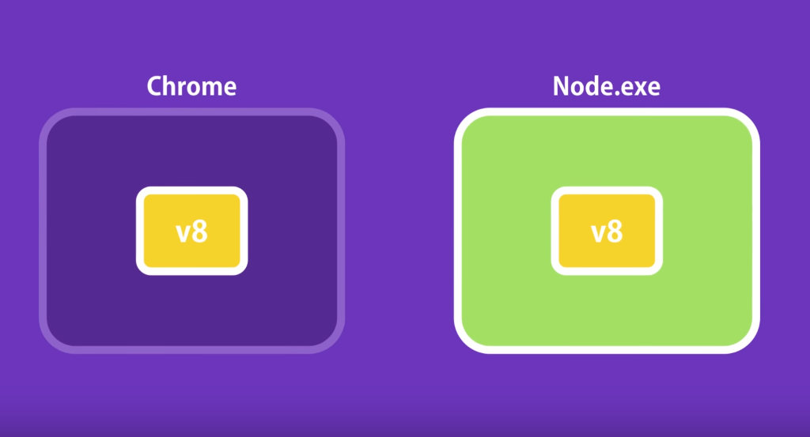
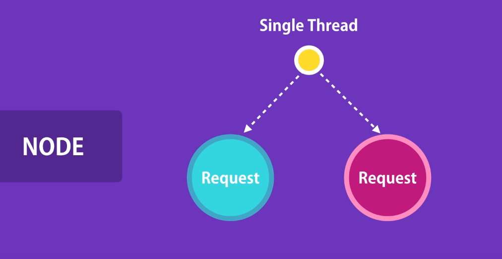
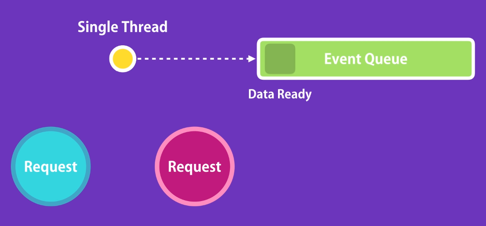

| Mirjam Lawall, #2003849, INF6, <Mirjam.Lawall@hs-augsburg.de>
| Felix Bühler, #2008336, INF6, <felix.buehler@hs-augsburg.de>

Einführung
================================

Node.JS ist eine Open-Source (unter MIT-Lizenz), Cross-Plattform JavaScript Laufzeitumgebung. Eingeführt wurde sie 2009 von Ryan Dahl. 

Dieser hatte die Vision, dass JavaScript nicht nur in einer Browserumgebung laufen könnte. Aus der Vision wurde das erste Programm node.exe. 

Es nutzt in einer C++ Laufzeitumgebung die von Google für ihren hauseigenen Browser entwickelte V8 Runtime für JavaScript.

.. _figlabel:

.. figure:: pics/nodeenv.png

Seit 2015 wird Node.JS unter dem Dach der Node.js Foundation weiterentwickelt. 

Node.JS erlaubt dem Nutzer durch eine Event getriebene Architektur, die asynchrone I/O Ausführungen unterstützt, z.B. einen Webserver laufen zu lassen. Dieser kann dann zum Beispiel dynamische Webseiten generieren und anschließend dem User zur Verfügung stellen.

.. _figlabel:

Architektur
================================

Request Handling – non blocking
--------------------------------

Node.JS arbeitet mit einer Single-Thread non-blocking Event-Loop Architektur und kann damit gleichzeitig viele gleichzeitig auftretende Client Anfragen bearbeiten.

Für unseren ersten Versuch nutzen wir einen simplen Web-Webserver der dem Nutzer über den Port 3000 ein View liefert und eine Socket-Verbindung aufbaut.

Versuch - Node.JS WebServer
---------------------------

**Versuch_1.js**

.. code-block:: javascript

	const app = require('express')()
	const http = require('http').Server(app)
	const io = require('socket.io')(http)

	app.get('/', function (req, res) {
	  res.sendFile(__dirname + '\\index.html')
	})

	io.on('connection', function (socket) {
	  console.log('a user connected')
	})

	http.listen(3000, function () {
	  console.log('listening on *:3000')
	})

**index.html**

.. code-block:: html

	<!doctype html>
	<html>
	<head>
		<title>Socket.IO chat</title>
		
	</head>
	<body>
	<ul id="messages"></ul>
	<form action="">
		<input id="m" autocomplete="off" /><button>Send</button>
	</form>
	
	
	</body>
	</html>

Im Folgenden wird zunächst abstrakt dargestellt, wie verschiedene Clients eine Anfrage an unseren Server senden und eine Antwort erhalten werden.

Zunächst bauen beide Clients eine Verbindung auf. Bei einer Socket-Anfrage erhalten beide Clients eine Bestätigung.

.. _figlabel:

Die Client-Anfragen beinhalten jeweils einen Request zur Darstellung einer Website. Da wir nur einen Thread haben möchten wir natürlich nicht, dass eine Anfrage und der Prozess zu dieser anderen Anfrage blockiert.

Daher wird die Anfrage in einer Ereignisliste abgelegt.

.. _figlabel:

Sobald die Anfrage vom Host-System bearbeitet wurde, wird der Eintrag in der Ereignisliste markiert, vom Thread bearbeitet und an das Client-System, welches die Anfrage gestellt hat, weitergeleitet.

.. _figlabel:

.. figure:: pics/node_3.png

Für dieses Beispiel ist das Ergebnis:

.. code-block:: javascript

	listening on *:3000
	a user connected
	a user connected
	
	
Nun stellt sich die Frage, was passiert in der Ereignisliste. Und was, wenn wir Anfragen stellen, die mit I/O Anfragen einhergehen. Denn wie wir wissen können solche I/O Anfragen zeitlich Anspruchsvoll sein.

Fortsetzung Versuch non-blocking
--------------------------------

Um dies zu realisieren ändern wir den Code unserer JavaScript Datei wie folgt:

.. code-block:: javascript

	const app = require('express')()
	const http = require('http').Server(app)
	const io = require('socket.io')(http)
	const process = require('process');
	const cluster = require('cluster');

	app.get('/', function (req, res) {
	  res.sendFile(__dirname + '\\index.html')
	})

	io.on('connection', async function (socket) {
	  await new Promise(resolve => {
		setTimeout(resolve, 3000)
	  })
	  const worker = cluster.
	  io.emit('chat message', process.pid + " " + worker.id)
	})

	http.listen(3000, function () {
	  console.log('listening on *:3000')
	  

In der Socket-Funktion blockieren wir die Ausführung der Ausgabe um 3000 Sekunden.

Dennoch, nehmen wir gleichzeitig eine Verbindung mit unterschiedlichen Clients auf erhalten wie folgende Ausgabe:

.. code-block:: javascript

	Auf Rechner 1: 9567 1
	Auf Rechner 2: 9567 2

Wir haben also einen Prozess (9567) sowie für jede Anfrage einen eigenen Worker, 1 und 2.

Event-Loop – Multi-Threading
--------------------------------

Daraus lässt sich nun folgendes Bild skizzieren:

.. _figlabel:

.. figure:: pics/node_4.png

Wie wir sehen, ist der Event Loop Single-Threaded, aber sobald die Requestanweisung in der Ereignisliste gespeichert wurde, wird sie innerhalb der C++ Laufzeitumgebung durch einen eigenen Thread behandelt. 

.. code-block:: javascript

	┌───────────────────────┐
	┌─>│        timers         │
	│  └──────────┬────────────┘
	│  ┌──────────┴────────────┐
	│  │     I/O callbacks     │
	│  └──────────┬────────────┘
	│  ┌──────────┴────────────┐
	│  │     idle, prepare     │
	│  └──────────┬────────────┘      ┌───────────────┐
	│  ┌──────────┴────────────┐      │   incoming:   │
	│  │         poll          │<─────┤  connections, │
	│  └──────────┬────────────┘      │   data, etc.  │
	│  ┌──────────┴────────────┐      └───────────────┘
	│  │        check          │
	│  └──────────┬────────────┘
	│  ┌──────────┴────────────┐
	└──┤    close callbacks    │
	   └───────────────────────┘

**timers**:  Führt Callbacks wie setTimeout und setInterval aus. Stellt nicht 100% sicher, dass der Callback auch zu der Zeit ausgeführt wird, wie es der Nutzer vorgegeben hat.

**I/O callbacks**: Führt alle I/O Callbacks aus. Ausgenommen Exceptions.

**idle**: prepare: Wird nur intern genutzt.

**poll**: Zeitfenster für neue Anfragen

**check**: Sortiert Liste neu, falls setImmediate gesetzt wurde.

**close** callbacks: z.B. socket.on('close', ...)

Dies ermöglicht dem Entwickler eine Anwendung zu entwickeln, die gleichzeitig Operationen auf Datenbanken, Dateisystemen oder ähnliches verwaltet ohne, dass sich der Entwickler über Ressourcenhandling Gedanken machen muss.

Libuv
------

libuv ist eine Programmbibliothek für asynchrone Ereignis-Benachrichtigung. Die Bibliothek unterstützt epoll (Linux), kqueue (FreeBSD), Windows IOCP und Solaris event ports. Sie wurde ursprünglich für Node.js geschrieben, wird mittlerweile allerdings auch von anderen Programmiersprachen genutzt.

Ausserdem sind folgende Features erwähnenswert

- Asynchrone TCP/UDP Sockets
- Asynchrone DNS Auflösung
- Asynchrone Dateisystem-Operationen
- Dateisystem Events
- Child Prozess Handling
- Thread Pool
- Synchronisation

Im Kontext von Node.JS übernimmt also die Libuv Bibliothek die Thread und Taskverwaltung. 

.. _figlabel:

.. figure:: pics/node_5.png

Zusammenfassung
------------------

Wie wir herausgefunden haben, stellt Node.JS die JavaScript Funktionalität in V8 mittels einer C++ Laufzeitumgebung bereit.

Node.JS verarbeitet mittels eines Threads eingehende Requests, speichert diese in einer Ereignisliste und sendet die Ergebnisse nach Verarbeitung an den Requester zurück.

Die I/O Operationen werden mittels Libuv in einem Thread-Pool verwaltet und ausgeführt.

Daraus ergibt sich folgendes Bild:

.. _figlabel:

.. figure:: pics/node_6.png

Quellen:
--------
https://socket.io/get-started/chat/

https://www.c-sharpcorner.com/article/node-js-event-loop/

https://codeburst.io/how-node-js-single-thread-mechanism-work-understanding-event-loop-in-nodejs-230f7440b0ea

https://github.com/libuv/libuv

https://en.wikipedia.org/wiki/Node.js
https://www.youtube.com/watch?v=XUSHH0E-7zk

https://stackoverflow.com/questions/36766696/which-is-correct-node-js-architecture

https://dzone.com/articles/nodejs-a-next-gen-technology-geek-to-geek
