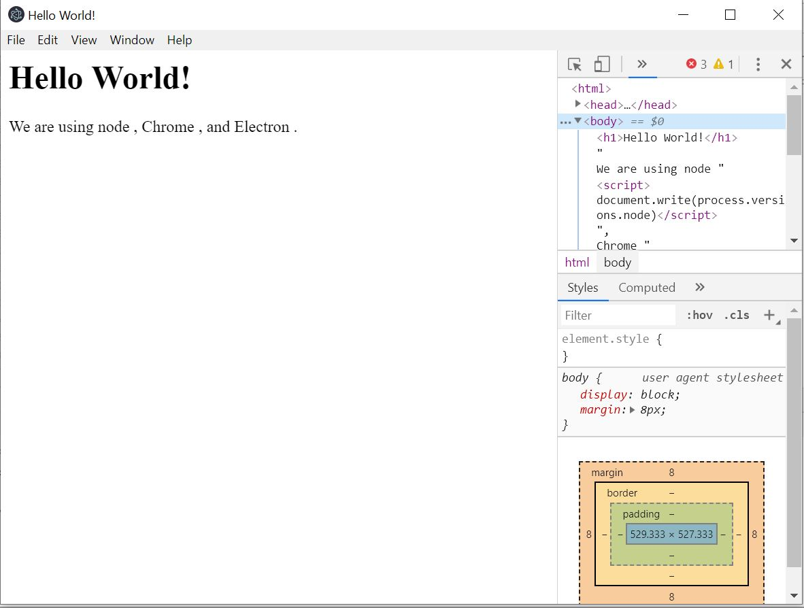

| Michael Bielang, #2036823, INF6, <michael.bielang@hs-augsburg.de>
| Tobias Druecke, #2004114, INF6, <tobias.drueeke@hs-augsburg.de>

NPM
====

NPM ist ein Paket-Manager für Node.JS. Über www.npmjs.com findet man tausende Pakete zum Download und kostenloser Verwendung.

Module
-------

In JavaScript gibt es vier Arten von Modulen
1.	Eine Datei verwendet über require("./fancyApp.js")
2.	Ein Ordner verwendet über require("./myLib/")
3.	Ein Core Modul verwendet über require("http");
4. 	Ein User Modul verwendet über npm install <ModulName> und dann wie 3.

Versuch: Verwendung eines User-Moduls
--------------------------------------

Wir erstellen ein neues leeres Projekt in IntelliJ.

Mit der rechten Maustaste im source Ordner erzeugen wir eine package.json Datei.

Dies sieht wie folgt aus

.. code-block:: json

	{
	  "name": "NodeJS",
	  "version": "1.0.0",
	  "dependencies": {
	  }
	}

Als nächstes geben wir in das Terminal folgenden Befehl ein ``npm install sequelize`` ein.

Nachdem die Abhängigkeit erfolgreich installiert wurde, sieht unsere Verzeichnisstruktur für die Module wie folgt aus:

.. code-block:: json

	├── node_modules
	│   └── sequelize
	│       ├── index.js
	│       ├── package.json
	│       └── readme.md
	└── package.json

Über ``const sequelize = require("sequelize")`` können wir das Modul nun verwenden.

Versuch: Eigenes Modul erzeugen
--------------------------------------

Schritt 1 - Erzeuge ein package.json

Gebe im Terminal folgenden Befehl ein ``npm init`` 

Dies erzeugt eine JSON Datei. Nun müssen nur noch die entsprechenden Felder ausgefüllt werden.

.. code-block:: json

	{
		"name": "awesome-module",
		"version": "0.0.1",
		"description": "does awesome stuff",
		"main": "lib/index.js",
		"author": "Hochschule Augsburg",
		"license": "Unlicense",
		"dependencies": {
			"jsdom": "^6.3.0",
			"koa": "^1.0.0"
		}
	}

Um nun Funktionen in dem Modul verfügbar zu machen, müssen diese lediglich exportiert werden.

.. code-block:: JavaScript

	//lib/index.js
	module.exports = function hello() {
		console.log("hello world!");
	};

Diese ist dann über ``const myModule = require("awesome-module")``  erreichbar.

Eigenes Modul veröffentlichen
------------------------

Dem Entwickler stehen zum veröffentlichen zwei Möglichkeiten zur Verfügung.

1. **Privat**

Über ``npm publish`` werden private lediglich privat gelistet und sind nur über diese Domain erreichbar ``https://npmjs.com/package/PACKAGENAME``

2. **Öffentlich**

Mittels ``npm publish --access public`` kann das Package für jedermann öffentlich bereitgestellt werden.
	   
Rob Pike

multi-way-concurrent control -> ``select``

Electron
========

Einführung
----------

Electron verwendet Chromium und Node.js, um Desktop-Apps mit HTML, CSS und JavaScript entwickeln zu können.

Electron ist plattformunabhängig, kann daher also auf MacOS, Windows als auch Linux entwickelt und verwendet werden.

Mit Electron wird einem das Erstellen einer Desktopanwendung einfach gemacht. Electron wird mittlerweile auch von Firmen wie Microsoft, Facebook, Slack und Docker für die Entwicklung von Applikationen verwendet.

Als Beispielanwendungen sind unter anderem Skype, Postman, Github Desktop, Discord und Slack zu nennen.

Versuch - Eine Electron App erstellen
--------------------------------------

Wie aus dem vorherigen Kapiteln gelernt erzeugen wir wieder in IntelliJ ein leeres Projekt.

Dort erzeugen wir eine package.json.

Wir haben nun folgende Ordnerstruktur

.. code-block:: JSON

	DVA-app/
	├── package.json
	├── main.js
	└── index.html
	
Mit folgendem Inhalt in der package.json

.. code-block:: JSON

	{
	  "name": "DVA-Seminar",
	  "version": "0.1.0",
	  "main": "main.js"
	}

Wir fügen nun noch ein Script hinzu und erhalten

.. code-block:: JSON

	{
	  "name": "DVA-Seminar",
	  "version": "0.1.0",
	  "main": "main.js",
	  "scripts": {
		"start": "electron ."
	  }
	}
	
Als nächstes installieren wir das electron Modul via ``npm install electron``

Jetzt implementieren wir die ``main.js``

.. code-block:: JavaScript

	const { app, BrowserWindow } = require('electron')

	// Behalten Sie eine globale Referenz auf das Fensterobjekt. 
	// Wenn Sie dies nicht tun, wird das Fenster automatisch geschlossen, 
	// sobald das Objekt dem JavaScript-Garbagekollektor übergeben wird.

	let win

	function createWindow () {
	  // Erstellen des Browser-Fensters.
	  win = new BrowserWindow({ width: 800, height: 600 })

	  // und Laden der index.html der App.
	  win.loadFile('index.html')

	  // Öffnen der DevTools.
	  win.webContents.openDevTools()

	  // Ausgegeben, wenn das Fenster geschlossen wird.
	  win.on('closed', () => {
		// Dereferenzieren des Fensterobjekts, normalerweise würden Sie Fenster
		// in einem Array speichern, falls Ihre App mehrere Fenster unterstützt. 
		// Das ist der Zeitpunkt, an dem Sie das zugehörige Element löschen sollten.
		win = null
	  })
	}

	// Diese Methode wird aufgerufen, wenn Electron mit der
	// Initialisierung fertig ist und Browserfenster erschaffen kann.
	// Einige APIs können nur nach dem Auftreten dieses Events genutzt werden.
	app.on('ready', createWindow)

	// Verlassen, wenn alle Fenster geschlossen sind.
	app.on('window-all-closed', () => {
	  // Unter macOS ist es üblich, für Apps und ihre Menu Bar
	  // aktiv zu bleiben, bis der Nutzer explizit mit Cmd + Q die App beendet.
	  if (process.platform !== 'darwin') {
		app.quit()
	  }
	})

	app.on('activate', () => {
	  // Unter macOS ist es üblich ein neues Fenster der App zu erstellen, wenn
	  // das Dock Icon angeklickt wird und keine anderen Fenster offen sind.
	  if (win === null) {
		createWindow()
	  }
	})

	// In dieser Datei können Sie den Rest des App-spezifischen 
	// Hauptprozess-Codes einbinden. Sie können den Code auch 
	// auf mehrere Dateien aufteilen und diese hier einbinden.
	

Und die ``index.html``

.. code-block:: HTML

	<!DOCTYPE html>
	<html>
	  <head>
		<meta charset="UTF-8">
		<title>Hello World!</title>
	  </head>
	  <body>
		<h1>Hello World!</h1>
		We are using node ,
		Chrome ,
		and Electron .
	  </body>
	</html>

Über den Befehl ``npm start`` können wir unsere App nun starten und erhalten folgende Ausgabe

.. _figlabel:

	
Quellen:
--------

https://www.w3schools.com/nodejs/nodejs_npm.asp

http://docs.libuv.org/en/v1.x/

https://de.wikipedia.org/wiki/Libuv

https://nodejs.org/api/

https://docs.npmjs.com/creating-node-js-modules

https://electronjs.org/

https://electronjs.org/docs/tutorial/first-app