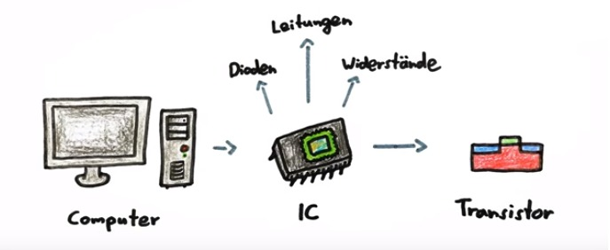
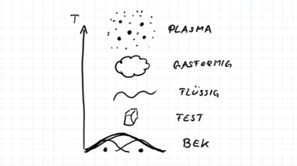

| Tobias Drüeke, <tobias.drueeke@hs-augsburg.de>, IN6, #2004114

Einführung
==========

Geschichte
----------
Die ersten Überlegungen und theoretischen Ansätze zu Quantencomputern wurden in den 80er Jahren gemacht. Der amerikanische Physiker Paul Benioff und der russisch-deutsche Mathematiker Juri Manin erarbeiteten beide ein Konzept. Doch die wichtigste Arbeit über Modelle von Quantencomputern veröffentlichte Feynman 1982. 

1994 entwickelte Peter Shor den ersten Algorithmus für Quantencomputer. Der Algorithmus kann selbst große Zahlen in effizienter Zeit in ihre Primfaktoren zerlegen. 

1996 entwickelte Lov Grover einen Quantenalgorithmus, der Datenbanken in quadratischer Zeit durchsuchen kann. 

Ende der 1990er Jahren wurde am MIT erfolgreich die Quantenfehlerkorrektur implementiert. 

Der nächste Meilenstein war 2001, als IBM erstmals den Shor-Algorithmus mit Hilfe der Kernspinresonanz umsetzte. 

Danach ist es ruhiger geworden. Die ersten Erfolge waren erbracht und die nächsten Schritte waren schwieriger. Die Skalierung auf eine größere Zahl echter Qubits hat sich für die Forscher schwieriger als gedacht herausgestellt.

 2017, fast 20 Jahre später, präsentiert IBM den ersten kommerziell nutzbaren Quantencomputer.
 

Herkömmliche Computer
---------------------
Herkömmliche Computer stellen Informationen durch Bits dar. Sie bestehen aus kleinen elektronischen Schaltkreisen (IC), die in Microchips eingebettet werden. Diese enthalten Dioden, Leitungen, Widerstände und Transistoren (elektrische Schalter), welche durch Spannungspotentiale, die 0 und 1 Bit bilden. 

.. _figlabel:

In den letzten Jahrzehnten wurden die Transistoren immer kleiner. Heute sind sie nur noch 10nm groß. Beispielsweise passen auf einen 2x2cm Chip 18 Milliarden Transistoren. Diese Miniaturisierung kommt jetzt allerdings an ihre physikalischen Grenzen. Die Transistoren können nicht noch kleiner werden. Eine weitere Grenze ist die Schaltgeschwindigkeit. Diese ist auf 5 GHz begrenzt. 

Quantencomputer
---------------
Ein Quantencomputer basiert auf den Gesetzen der Quantenmechanik. Im Gegensatz zu klassischen Computern ist er in der Lage, Prozesse und verschiedene Zustände parallel auszuführen. Dadurch können noch effektivere Algorithmen entwickelt und die Rechenzeit stark verkürzt werden. Natürlich können auch herkömmliche Computer parallel rechnen. Allerdings ist das nur mit einem erhöhten Aufwand an Hardware, sowie einem hohen Energie- und Platzbedarf möglich. Die Verarbeitung von quantenmechanischen Zuständen erfolgt nach 2 Prinzipien:

1. Superpositionsprinzip:
'''''''''''''''''''''''''
Digitalrechner haben Bits, welche eine ``1`` oder eine ``0`` sind. Sie können also nur eine Information pro Zeit speichern. Beim Quantencomputer gibt es die sogenannten Qubits. Deren Zustände sind nicht "entweder - oder" sondern "sowohl - als auch". Es können die Zustände ``1`` oder ``0`` angenommen werden. Aber es können auch die Zustände ``1`` und ``0`` und alles was dazwischen liegt gleichzeitig angenommen werden: ``1/0`` (Superposition). Die Superposition gilt nur solange das Qubit unbeobachtet ist. Sobald der Zustand ermittel wird, kollabiert es mit einer Wahrscheinlichkeit von 50% in den ``1`` Zustand oder ``0`` Zustand. Dies kann man sich gut mit der so genannten Bloch-Kugel vorstellen. Die Werte ``0`` und ``1`` werden mit Pfeilen durch den Nord- und Südpol dargestellt. Das Qubit kann dann alle Werte annehmen, die auf der Kugeloberfläche liegen. 

n Qubits haben die gleiche Rechenleistung wie 2^n Bits in der gleichen Zeit: 

n Qubit = 2^n Bits

1. 1 Bose-Einstein-Kondensat (Quantenmechanik)
.......................
Es gibt 3 klassische Aggregatszustände: gasförmig, flüssig und fest. Es gibt jedoch auch nicht klassische Aggregatszustände. Einer davon ist das Plasma. Bei sehr hohen Temperaturen lösen sich die Elektronen von den Kernen. Die Teilchen zerfallen. Der zweite nicht klassische Aggregatszustand ist das Bose-Einstein-Kondensat. Bei sehr tiefen Temperaturen erhält man sogenannte Quantenobjekte. Diese Teilchen haben keinen festen Ort mehr. Die Wahrscheinlichkeit mit der sich ein Teilchen an einem Ort befindet, wird durch eine Wellenfunktion beschrieben. Wenn sich die Wellen von zwei Teilchen überlagern, entsteht dadurch eine Welle. Dies bezeichnet man als sogenannte Superposition. Es kann jetzt nicht mehr unterschieden werden, welches Atom sich wo befindet, sie haben nun beide eine gemeinsame Wellenfunktion und sind somit für uns nur noch ein Teilchen.

.. _figlabel:

2. Quantenverschränkung:
''''''''''''''''''''
Zwei Verschränkte Qubits verhalten sich, als würden sie zusammengehören, unabhängig von ihrer Entfernung (über tausende Kilomenter oder Lichtjahre). Der eine Partner nimmt immer den Zustand des mit ihm verschränkten Partners an, ohne zeitliche Verzögerung. Albert Einstein lehnte dieses Phänomen der "spukhaften Fernwirkung" damals ab. Allerdings konnte dieses Phänomen inzwischen experimentell bestätigt werden.

2.1 Quantenteleportation (Quantenmechanik)
....................................................
Bei der Quantenteleportation werden keine Teilchen von A nach B teleportiert. Es werden stattdessen die Quanteneigenschaften (Quantenzustand) eines Teilchens teleportiert. Es gibt dabei im Raum keinen Übertragungsweg, da die Informationen durch Quantenverschränkung übertragen werden. Dieses Phänomen wurde von Einstein, Podolsky und Rosen beschrieben (Einstein-Podolsky-Rosen-Paradoxon). Da es keinen Übertragungsweg gibt, gibt es auch nichts, was sich mit einer bestimmten Geschwindigkeit bewegen kann.

Technologische Singularität
---------------------------
Unter der technologischen Singularität versteht man den Zeitpunkt ab dem die Technik den Menschen überholt und sich selbst verbessern kann. Dadurch würden große Fortschritte in kurzer Zeit vollbracht. Quantencomputer spielen dabei eine wichtige Rolle, da sie nicht durch die Physik begrenzt sind. 

Konsequenzen von Quantencomputern: Verschlüsselungen
-----------------------------------------------------
Fast alle heute genutzen Verschlüsselungsmethoden basieren auf einer Faktorzerlegung. 
Bei digitalen Computern steigt der Zeitaufwand mit der Länge der Zahl exponentiell. Bei einem Quantencomputer steigt der Zeitbedarf nicht stärker als die Verschlüsselung selbst. Sollten Quantencomputer also tatsächlich Realität werden, bräuchten wir schnell neue Verschlüsselungsverfahren. Allerdings benötigt man um einen RSA-Code zu knacken, laut Experten, einige tausend verschränkte Qubits. Davon sind wir heute noch sehr weit entfernt. 

Es werden werden bereits unter dem Namen Quantenkryptographie "sichere" Hashalgorithmen und symmetrische Verschlüsselungen angeboten. Allerdings kann bis jetzt noch nicht bewiesen werden, dass diese Verschlüsselungen tatsächlich sicher sind. Deshalb stehen diese "sicheren" Algorithmen eigentlich für "uns ist dazu noch nichts eingefallen" [1].

Quellen
-------

https://hp.physnet.uni-hamburg.de/heyszenau/prosem/skript.pdf

https://www.youtube.com/watch?v=-oTGgp3s0VI

https://www.wire.tu-bs.de/OLDWEB/akeese/seminarSS01/vortraege/qc1_ausarbeitung.pdf

https://www.golem.de/news/geschichte-des-quantencomputings-das-ganze-universum-ist-ein-quantencomputer-1705-127600.html

https://www.elektronikpraxis.vogel.de/rechnen-mit-qubits-so-arbeitet-ein-quantencomputer-a-648407/

https://medium.com/@markus.c.braun/a-brief-history-of-quantum-computing-a5babea5d0bd

[1] Gilbert Ross, "Einführung in die Quanteninformatik", Springer

http://www.quantenwelt.de/quantenmechanik/vielteilchen/verschraenkung.html

https://www.youtube.com/watch?v=m9aXUvPOv8U

https://de.wikipedia.org/wiki/Quantenteleportation
