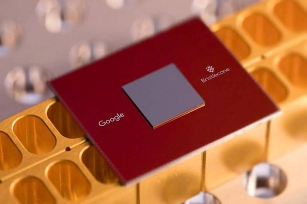
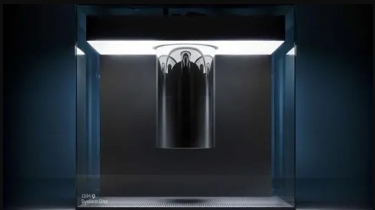
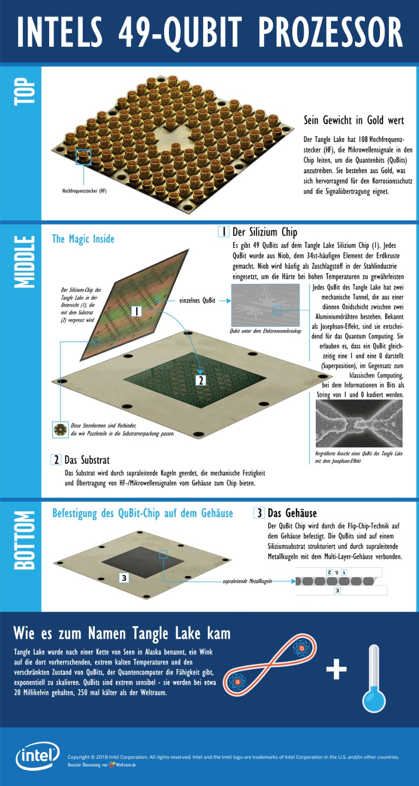
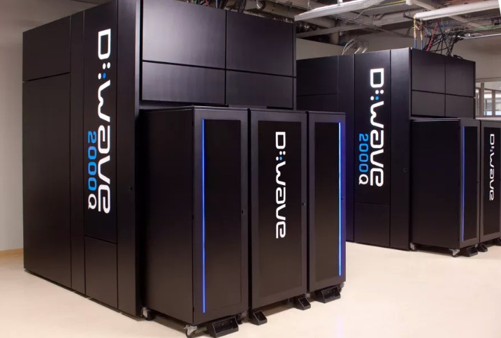

| Felix Bühler, <felix.buehler@hs-augsburg.de>, IN6, #2008336

gebaute Quantencomputer
=======================

Inzwischen arbeiten alle großen Computerhersteller und Internetfirmen an Quantencomputern.

Alphabet (Google)
-----------------

Im März 2018 stellte Google seinen neuen Quantencomputer "Bristlecone" in der American Physical Society vor. 

Aufbau
''''''
Der Bristlecone-Prozessor hat eine Rechenleistung von 72 Quantenbits. Bristlecone besteht aus elektronischen Schaltkreisen in denen supraleitende Microchips integriert sind. Er soll komplizierte Optimierungsprobleme lösen und komplexe Simulationsrechnungen ausführen können, welche für normale Rechner nicht lösbar sind. 

Problem
''''''''
Die größte Schwierigkeit besteht in der Fehlerrate, welche die Ergebnisse unzuverlässig macht. Derzeit werden die Ergebnisse überprüft, indem die Simulationen zusätzlich auf einem klassischen Supercomputer ausgeführt werden. Das ist allerdings nicht mehr möglich, wenn Simulationen ausgeführt werden sollen, welche nur mit Quantencomputern ausführbar sind. Google arbeitet bereits an einer Minimierung der Fehlerrate.

.. _figlabel:

IBM
---

Im Januar 2019 hat IBM den ersten kommerziellen Quantencomputer auf der Elektronikmesse CES 2019 in Las Vegas vorgestellt. Er ist über eine Cloud auch für Firmen und Forschungseinrichtungen zugänglich. 

Aufbau
''''''
Der sogenannte IBM Q System hat 20 Qubits und befindet sich in einer luftdicht verschlossenen 2,5 mal 2,5m großen Glasbox. Potentielle Anwendungen sind laut IBM, das Lösen komplexer Optimierungsprobleme oder die Modellierung schwer zugänglicher Eigenschaften von Festkörpern, Flüssigkeiten, Gasen oder anderen Vielteilchensystemen und den darin ablaufenden Prozessen. 

Problem
''''''''
Allerdings ist auch der IBM Q System noch ein Prototyp, mit dem einige Anwendungen erprobt und weiterentwickelt werden können. Aber es ist noch kein Quantencomputer, welcher all die Probleme lösen kann, wie man es vom Quantum-Computing erwarten würde.

.. _figlabel:

Intel
-----

Intel hat bei der CES 2018 den "Take Lake", einen 49-Qubit-Test-Chip, vorgestellt.

Name
'''''
Der Chip heißt "Tangle Lake". Das ist eine Anspielung auf eine See-Gruppe in Alaska, die sehr kalt sind. Auch der Quantenprozessor benötigt eine sehr niedrige Temperatur von 20 Millikelvin (< -273°C). 

Aufbau des Chips
''''''''''''''''

Dieser Quantenprozessor hat 49 Qubits und ist ein supraleitender Chip. Seine Maße sind 7,5 x 7,5cm. Er soll bei der Forschung zur Fehlerkorrektur eingesetzt werden.

.. _figlabel:

Microsoft
---------

Auch Microsoft arbeitet bereits an Quantencomputern. Bis 2023 wollen sie den ersten fertigen Quantencomputer vorstellen. 

Vorteil gegenüber anderen Unternehmen
'''''''''''''''''''''''''''''''''''''
Die Basis bilden sogenannte topologische Qubits. Sie benötigen erheblich weniger Fehlerkorrekturmechanismen. Laut Microsoft werden qualitativ hochwertige Qubits verwendet, welche deutlich besser als die der Konkurenz sind. Diese Qubits benötigen für dieselben Aufgaben sehr viel weniger Qubits. Währenddessen muss die Konkurenz sich mit der Fehlerkorrektur für deutlich mehr Quits auseinander setzen.

Topologische Qubits
'''''''''''''''''''

Sie wurden erstmals 2003 von Alexei Kitaev beschrieben. Im Gegensatz zu anderen Ansätzen sollen sie unempflindlich gegen magnetische, elektrische und andere Störungen sein. 

D-Wave-System:
--------------
Das D-Wave-System wurde 2017 auf der IT-Messe Cebit von D-Wave vorgestellt. 

Aufbau
'''''''
Ein Chip besteht aus 2048 Qubits, welche durch 5600 Koppler untereinander verbunden sind. 

Problem
''''''''
Der Computer kann Quanteneffekte, wie Tunneleffekt, Superposition und Verschränkung von Teilchen nutzen. Allerdings ist keine Manipulation und Interaktion mit den Quantenzuständen möglich, da die Qubits zu instabil sind. Dieser Chip basiert somit zwar auf Quanteneffekten, ist aber im eigentlichen Sinne prinzipiell kein echter Quantencomputer. Stattdessen spricht man hier von "Quanten-Annealing". Über die Leistungsfähigkeit dieses "Quantencomputers" streiten sich die Forscher. Manchmal löst dieser "Quantencomputer" Probleme besser als ein digitaler Computer. Aber dann zeigt sich auch wieder, das optimierte Algorithmen auf herkömmlichen Computern besser sind.

.. _figlabel:

Quanten-Annealing
''''''''''''''''''
Beim Quanten-Annealing werden subatomate Partikel genutzt, um Rechenoperationen durchzuführen. "Annealing" heißt auf deutsch "Glühen" und kommt vom Glühvorgang in der Stahlindustrie. Bei der Metallverarbeitung gibt es die drei Phasen "Anwärmen", "Halten" und "Abkühlen". Ähnlich verhält sich dies auch beim Durchführen von Berechnungen mit Qubits. Diese wechseln von der Quantenüberlagerung in einen klassischen Zustand 0 oder 1, indem sie Energie zugeführt bekommen.

Quellen
-------

https://ai.googleblog.com/2018/03/a-preview-of-bristlecone-googles-new.html

https://www.faz.net/aktuell/wirtschaft/diginomics/google-stellt-neuen-quantencomputer-namens-bristlecone-vor-15480332.html

https://www.faz.net/aktuell/wissen/computer-mathematik/ibm-praesentiert-den-ersten-kommerziellen-quantencomputer-15980196.html

https://www.spektrum.de/news/google-enthuellt-bisher-groessten-quantencomputer/1549295

https://www.golem.de/news/tangle-lake-intel-zeigt-49-qubit-chip-1801-132042.html

https://winfuture.de/infografik/18695/Aufbau-einer-Quanten-CPU-1528293037.html

https://www.golem.de/news/qubits-mit-geringer-fehlerrate-microsoft-will-den-ersten-rechner-2023-fertig-haben-1805-134297.html

https://www.golem.de/news/d-wave-quantencomputer-oder-computer-mit-quanteneffekten-1703-126863.html

