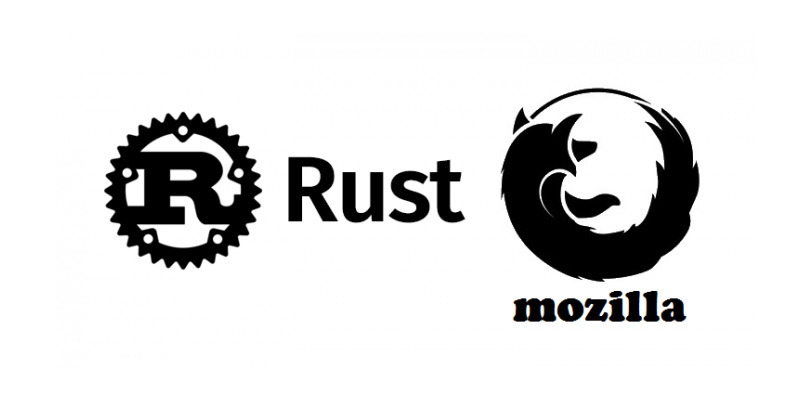

| Felix Bühler, <felix.buehler@hs-augsburg.de>, IN6, #2008336

Einführung
===========

.. _figlabel:

Die Programmiersprache Rust entstand aus einem privaten Projekt von Graydon 
Hoare, einem Mozilla-Miarbeiters. Im Jahr 2009 begann Mozilla das Projekt zu 
sponsern. Ein Jahr später begann die Entwicklung eines eigenen, in Rust 
geschriebenen Compilers, den rustc. Die erste stabile Version des Compiler
und der Bibliothek wurde am 15.05.2015 veröffentlicht.

Rust ist eine Systemprogrammiersprache. Die Programmiersprache hat einen 
Fokus auf Sicherheit, Geschwindigkeit und Nebenläufigkeit. Mit Sicherheit ist 
gemeint, dass Programmierfehler, Speicherzugriffsfehler und Pufferüberläufe 
vermieden werden. Rust hat zwar eine automatische Speicherverwaltung aber 
kommt ohne einen Garbage Collector aus. Die Programmiersprache  vereint 
mehrere Programmierparadigmen: funktionale, objektorientierte und nebenläufige 
Programmierung. 

Die Effizienz ist mit C++ vergleichbar. Erreicht wird das durch die geringen 
Kosten der Abstraktionen zur Laufzeit (zero-cost abstractions). 

Rust kann in andere Sprachen eingebettet werden und ist besonders geeignet für 
Programme, die besondere Anforderungen an Speicher- oder Zeitbedarf haben. Aber 
auch für das Schreiben von Low-Level Code (zB Betriebssystem) ist Rust gut geeignet.

Das fertig compilierte Programm ist Plattformunabhängig. Es wird eine cross platform binarie erstellt. 

Anwendung
---------

Bisher war C/C++ die verbreitetste Sprache für die Entwicklung von Betriebssystemen und leistungskritischen Anwendungen. Mit Rust soll sich das nun ändern. Ziel dabei ist es die Stärken dieser Sprachen zu behalten und gleichzeitig die Schwächen abzulegen. 

Bevor man mit dem Programmieren beginnen kann, muss Rust und der Compiler rustc installiert werden. Es gibt auch die Möglichkeit die `Online-Entwicklungsumgebung <https://play.rust-lang.org/>`_ zu nutzen. 

.. code-block:: shell

    curl -f -L https://static.rust-lang.org/rustup.sh -O
    sh rustup.sh

(Die obigen Befehle funktionieren nur in Linux und Mac. Für Windows gibt es einen eigenen `Installer <https://www.rust-lang.org/tools/install>`_)

Hello World (hello_world.rs)
'''''''''''''''''''''''''''''

.. code-block:: c

    fn main() {
        println!("Hello, world!");
    }

Dieses Hello World Programm gibt den Text "Hello, world!" auf der Console aus.
Dazu muss es zunächst compiliert werden, indem man folgendes Kommando in die
Console eingibt.

.. code-block:: shell

    rustc hello_world.rs

Rustc erzeugt dann eine binäre, ausführbare Datei main. Diese man mit folgendem 
Befehl ausführen kann:

.. code-block:: bash

    ./main

(In Windows würde eine main.exe erzeugt)

Fakultäts-Funktion
'''''''''''''''''''

Zum berechnen einer Fakultät gibt es in Rust einen rekursiven und eine iterativen Lösungsweg.

Iterativ
..........

.. code-block:: c

    fn fakultaet(i: u64) -> u64 {
        let mut acc = 1;
        for num in 2..=i {
            acc *= num;
        }
        acc
    }

Das Schlüsselwort ``mut`` in Zeile 2 kennzeichnet die Variable acc als veränderbar. Das ist notwendig, da in der Schleife in Zeile 4 der Variablen ein neuer Wert zugewiesen wird. Eine return Anweisung ist in Rust nicht nötig. Der letzte Ausdruck eines Blocks welcher kein ``;`` am Ende stehen hat wird als return Wert gewertet.

Rekursiv
.........

.. code-block:: c

    fn fakultaet(i: u64) -> u64 {
        match i {
            0 => 1,
            n => n * fakultaet(n-1)
        }
    }

Cargo
-----

Cargo ist eine Paketverwaltungssoftware für Rust-Pakete. Diese Pakete bezeichnet man als Crate. Es übernimmt für jedes Paket das

    - Bauen des Codes
    - Herunterladen der Abhängigkeiten
    - Bauen der Abhängigkeiten

Cargo Projekt erstellen
''''''''''''''''''''''''

Dazu erstellt man zunächst eine Cargo.toml Konfigurationsdatei und legen 
die hello_world.rs in einen ``src`` Ordner.

Cargi.toml:

.. code-block:: shell

    [package]

    name = "hallo_welt"
    version = "0.0.1"
    authors = [ "Mirjam Lawall <Mirjam.Lawall@hs-augsburg.de>"]

Das TOML-Format ist ein minimales Konfigurationsformat, welches leicht zu lesen
ist. Es bildet eindeutig auf eine Hashtabelle ab. 

Nun muss das fertige Projekt gebaut werden. Dazu führt man folgende Zeilen im
Terminal aus:

.. code-block:: shell

    cargo build
    ./target/debug/hallo_welt
    >> Hello, world!

Später wenn das Projekt komplexer ist kann man so einfach ``cargo build`` 
aufrufen und Cargo erstellt das Projekt. Mit ``cargo build --release`` kann 
eine Release Version gebaut werden. Diese enthält zusätzliche Optimierungen.

Währende dem Build hat Cargo eine neue Datei ``Cargo.lock`` erstellt. 

.. code-block:: shell

    [root]
    name = "hello_world"
    version = "0.0.1"

In dieser Datei speichert Cargo die Abhängigkeiten. Jetzt haben wir noch keine, 
desshalb ist die Datei noch sehr kurz. Allerdings verwaltet Cargo die Datei
selbstständig, der Entwickler muss dort nichts anpassen.

Alternativ kann man auch einfach ``cargo new`` ins Terminal eingeben, dann
wird automatisch ein neues Projekt erzeugt.

Vorteile von Rust
------------------

1. aus Rust C Funktion aufrufen
''''''''''''''''''''''''''''''''

C und alle kompatiblen Programmiersprachen können eingebunden werden.

.. code-block:: c

    #[link(name = "hello")]
     extern {
        fn c_hello() -> c_int;
     }

     fn main() {
        println!("Hello world from Rust!");

        unsafe {
            c_hello();
        }
     }

In diesem Beispiel existiert eine libhello.so, welche die C Funktion c_hello 
enthält. In der ersten Zeile wird angegeben, in welcher Shared Library die 
Funktion zu suchen ist. Im Kontrollblock ``extern`` ist definiert wie diese 
Funktion in Rust aufgerufen werden kann. Die Funktion heißt c_hello und gibt 
eine Ganzzahl int zurück. 

Für Rust ist C eine unsichere Sprache. Deshalb sind die C Funktionsaufrufe nur 
in unsafe-Blöcken möglich. Wenn im Programm dann ein Speicherproblem auftritt,
weiß man das es in einem der unsafe-Blöcke sein muss. In allen andren Bereichen garantiert der Rust-Compiler das kein Fehler auftritt. So wird die Fehlersuche
reduziert. 

2. Performance
'''''''''''''''

So effizient wie C/C++ und so sicher wie eine Interpretersprache.
Rust kompilliert den Programmcode in Maschinencode, genauso wie C/C++. 

Rust ist sehr schnell, das wird unter anderem durch den niedrigen Laufzeit-Overhead erreicht (siehe 2. Sicherer Umgang mit Speicher). Die Schnelligkeit ist besonders auschlaggebend für Programme welche oft ausgeführt werden. Insgesamt ist es von der Schnelligkeit mit C/C++ vergleichbar.

3. Sicherer Umgang mit Speicher
''''''''''''''''''''''''''''''''

Der Sicherer Umgang mit Speicher vermeidet Wettlaufsituationen. (Alleinstellungsmerkmal)

In Rust können Threads nur Varibalen nutzen, deren Laufzeit mindestens genauso
lang wie die des Threads ist. Hier gibt es auch die sogenannten ``static lifetime`` 
Variablen, diese existieren bis das Programm beendet wird.

Rust bietet eine sichere Speicherverwaltung ohne dabei auf einen Garbage Collector zurückzugreifen. Ein Garbage Collector prüft zur Laufzeit welche Speicherbereiche nicht mehr benötigt werden und gibt diese frei. Rust besimmt dies bereits zur Compilierzeit. Dies gelingt Rust durch das ``Ownership Konzept``.

Ownership Konzept
..................

    In Rust gibt es immer nur einen Besitzer eines Speichers. Nur dieser 
    Besitzer darf den Speicher freigeben. Wenn das Objekt verliehen werden 
    soll müssen Referenzen erzeugt werden. Verleihen darf nur der Besitzer.

Durch dieses Konzept ist die Speicherverwaltung sicher und das Realisieren 
von nebenläufigen Code einfacher.

Der Entscheidende Unterschied ist, dass der C/C++ Compiler den Code übersetzt.
Ein Rust Compiler tut das jedoch nicht. Stattdessen prüft er die Variablen, und
zeigt dann Fehler an, falls ein Thread eine Variable nutzt welche nicht so lang 
lebt wie der Thread selbst. Obwohl das Programm syntaktisch korrekt ist, akzeptiert der Rust Compiler es nicht. 

4. rustdoc
'''''''''''

Mit Rustdoc kann der geschriebene Code direkt für die Dokumentation verwendet werden. 

5. Biblitoheken
'''''''''''''''

Richtige Rust-Biblitheken gibt es noch wenige, dafür bietet es eine umfangreiche Standardbibliothek. Und es ist möglich auf die C-Bibliotheken zuzugreifen. Es ist auch eine Sprachanbindung an Python gegeben, wodurch auch viele Funktionen anderer Sprachen verwendet werden können.

6. Portabilität
''''''''''''''''

Rust wurde als für die Systemebene entwickelt, desshalb ist sie sehr auf Portabilität ausgelegt. Es ist zB möglich Rust auf dem AVR-Mikrocontroller des Arduinos laufen zu lassen. Allerdings kann dann nicht auf die Rust-Standardbibliothek zugegriffen werden, da diese ein Bestriebssystem voraussetzt.

Quellen
========

    https://de.wikipedia.org/wiki/Rust_(Programmiersprache)

    https://www.heise.de/developer/artikel/Rust-als-sichere-Programmiersprache-fuer-systemnahe-und-parallele-Software-4155591.html

    https://www.maibornwolff.de/blog/rust-fuenf-pluspunkte
    
    https://www.golem.de/news/rust-ist-die-neue-programmiersprache-besser-1606-121227.html

    https://rust-lang-de.github.io/rustbook-de/

    https://de.wikipedia.org/wiki/Cargo_(Software)

    https://www.golem.de/news/rust-ist-die-neue-programmiersprache-besser-1606-121227-3.html

